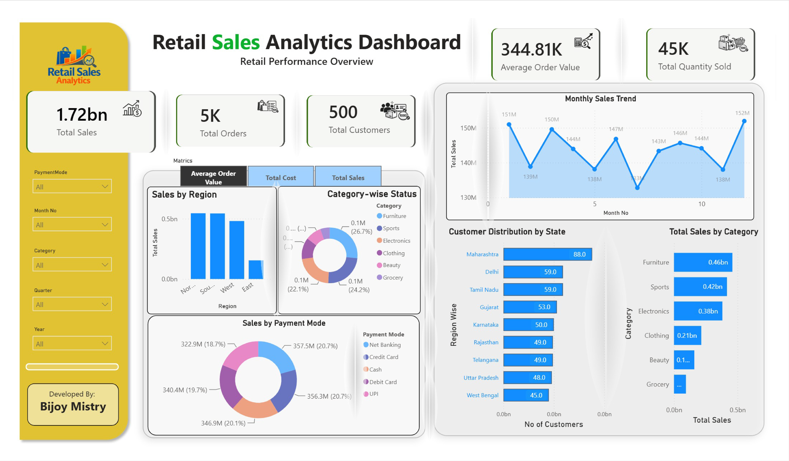

# 📊 Retail Sales Analytics Dashboard

<p align="center">
  
</p>

<p align="center">
  <a href="RetailSalesAnalytics-Final.mp4">
    
  </a>
  <a href="Retail_Sales_Analytics_Case_Study.pdf">
    
  </a>
  <a href="Retail Sales Analytics.pbix">
    
  </a>
</p>

## Project Overview

This is an end-to-end Data Analytics project built using SQL, Python, Excel, Power Query, DAX, and Power BI.

The objective was to simulate a real-world retail business environment by generating synthetic datasets, validating them using SQL, performing exploratory data analysis with Python, and building an interactive Power BI dashboard for business decision-making.

---

## Business Problem

Retail businesses generate large amounts of sales data every day. Without proper analytics, it becomes difficult to understand customer behavior, regional performance, product sales, and revenue trends.

This project demonstrates how raw data can be transformed into meaningful business insights.

---

## Tools & Technologies

- SQL
- Python
- Pandas
- NumPy
- Matplotlib
- Seaborn
- Microsoft Excel
- Power Query
- Power BI
- DAX

---

## Project Workflow

Synthetic Data Generation

↓

SQL Validation

↓

Excel Verification

↓

Python Data Cleaning

↓

Exploratory Data Analysis (EDA)

↓

Power Query ETL

↓

DAX Measures

↓

Interactive Power BI Dashboard

↓

Business Insights

---

## Dashboard Features

- KPI Cards
- Monthly Sales Trend
- Regional Sales Analysis
- Customer Distribution
- Category-wise Sales
- Payment Mode Analysis
- Interactive Filters

---

## Business Insights

- Identified top-performing sales regions.
- Analyzed customer distribution across states.
- Compared category-wise revenue contribution.
- Evaluated monthly sales trends.
- Monitored payment mode usage.
- Built KPI-driven executive dashboard.

---

## Repository Structure

```text
Dataset/
SQL/
Python/
Dashboard/
Images/
Presentation/
```

---

## Author

**Bijoy Mistry**

Data Analyst | SQL | Python | Power BI | Excel | Business Intelligence
